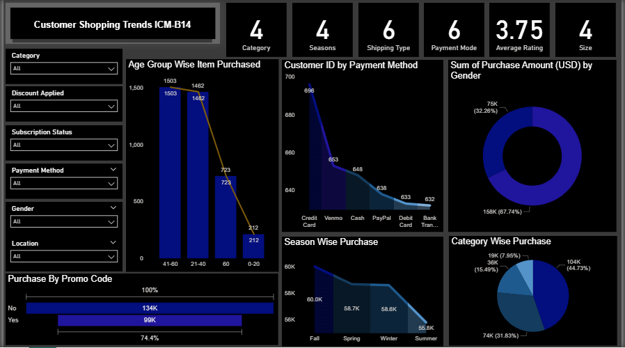
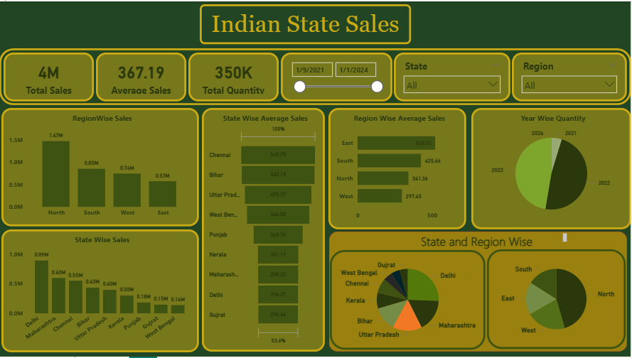
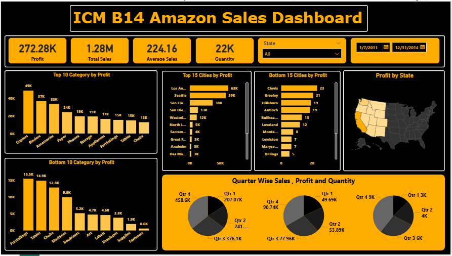

# Dashboards Portfolio — Vivek Singh

This repository contains my **Power BI dashboards** created for sales and customer analytics.  
Each dashboard is fully interactive and built with DAX measures, filters, and KPIs.

---

## 📊 1. Customer Shopping Trends
**Overview:**  
Ye dashboard customer ke shopping patterns ko track karta hai. Isme Age Group, Gender, Payment Method, Season aur Promo Code usage dikhaya gaya hai.  

**Key Insights:**  
- 41–60 aur 21–40 age groups sabse zyada purchases karte hain.  
- Credit Card aur Venmo most popular payment methods hain.  
- Promo Code usage sirf ~25% hai.  
- Fall season sabse zyada sales generate karta hai.  

---

## 📊 2. Indian State Sales
**Overview:**  
Ye dashboard India ke states aur regions ka sales performance dikhata hai. Isme Total Sales, Average Sales aur Year-wise Quantity included hai.  

**Key Insights:**  
- North region sabse zyada sales karta hai (~1.47M).  
- Top states: Delhi (0.89M) aur Maharashtra (0.64M).  
- East region ka average sales sabse high hai (~520.9K).  
- 2021–22 mein sales growth peak par thi.  

---

## 📊 3. ICM B14 Amazon Sales
**Overview:**  
Amazon ke sales aur profit data ka analysis. Isme Category, City, State aur Quarter-wise breakdown diya gaya hai.  

**Key Insights:**  
- Copiers, Appliances aur Phones sabse profitable categories hain.  
- Los Angeles, Seattle aur San Francisco top profitable cities hain.  
- West Coast states sabse zyada profit generate karte hain.  
- Q1 aur Q2 sabse profitable quarters hain.  

---

## 🔧 Tools Used
- Power BI Desktop  
- DAX for KPIs  
- CSV/Excel datasets  

---

## 📬 Contact
For freelance projects:  
- Email: your-email@example.com  
- Fiverr: [Your Fiverr link]  
- LinkedIn: [Your LinkedIn link]
